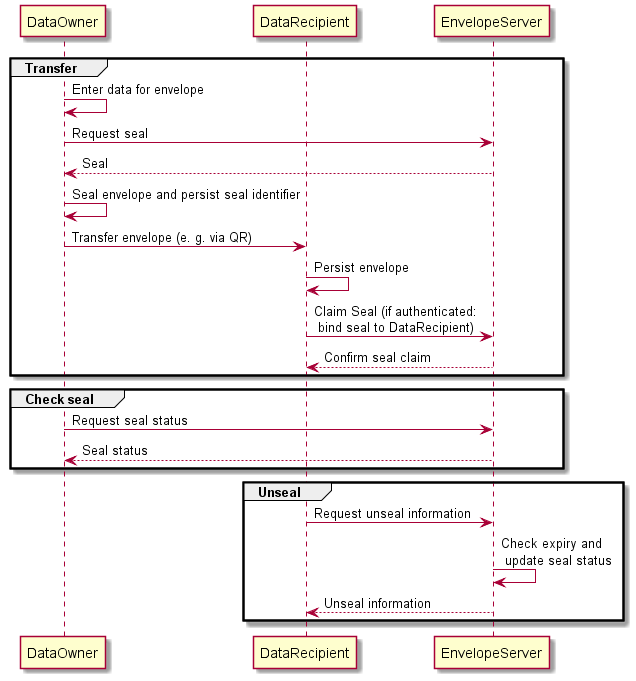

# SealedEnvelope

## Project description
This project allows data transfer to a semi-trusted party, where the need for data revelation is dependent on future events. Its purpose is to increase the privacy of data which are revealed without any use "just in case".SealedEnvelope works like its name says: You hand over a sealed envelope. It is only opened if needed. If it was opened, you can detect that it was opened.

**Example use case 1:** *During the COVID-19 pandemic, you visit a restaurant which is forced to register your personal details such as name and contact data. In case there is no COVID-19 case (which is very likely) the disclosure of these data has been without any use. Furthermore, the restaurant had to make sure that your data is secure. Only in the unlikely event of a COVID-19 case, the data has to be inspected and used for further investigation.*

**Example use case 2:** *A parcel service asks you to provide some contact details in case there are urgent questions regarding your parcel. Most of the times, the parcel goes its way without any issues and they do not need to contact you, however your contact details are stored in the parcel service's systems without use.*

**Example use case 3:** *Your employer asks you to deposit emergency contact details of your partner. In the unlikely event of an emergency (e. g. you having an medical emergency at work or you unexpectedly staying away from work), your employer can reveal the information to contact your partner, however, if there is no emergency, the employer stores unused information "just in case".*

**Example use case 4:** *You want to give a neighbour the PIN for your electronic front door lock. It should only be used for emercency cases and you want to know, if he ever has revealed the PIN.*

## How does it work?
To get an overall understanding of the process, the following bullet points describe the three involved parties *(please refer to the [specification](#Specification) for details)*:

- The *data owner* (e. g. the restaurant visitor) enters his data into a client-side application, retrieves an identifier and a secret generated by the *SealedEnvelope server*, attaches the identifier, encrypts the data and transfers the encrypted data (e. g. by providing an QR code).
- The *SealedEnvelope server* generates new secrets on *data owner* request. This happens for each data transaction. The secrets are stored along with an identifier. The server furthermore hands over secrets to registered and authenticated *data recipients*. Afterwards, the status of the secret will be changed to "revealed" and the *data owner* can check this (pull approach).
- The *data recipient* (e. g. a restaurant owner) receives the *data owners* encrypted data (e. g. by scanning the QR code) and persists the content. As only the values are encrypted, he can verify that the structure of the received data (keys) is valid. If the *data recipient* needs to decrypt the data, he retrieves the secret from the *SealedEnvelope server* (registration required) by the identifier he knows and can decrypt the data for further use. 

The following diagram demonstrates the process:

## Modes
There are two modes for exchanging information:

- *peer2peer* / *self-contained*: The transferred envelope contains a token to retrieve the secret, so anybody who has access to the envelope can actually retrieve the secret without confirming his/her identity  (no registration required).
- *Authenticated*: The transferred envelope contains a token to retrieve the secret, but the entity retrieving the secret must authenticate with client credentials (registration required) so it is not possible to anonymously retrieve it. To avoid that somebody else retrieves the secret, the data recipient can claim the envelope (linking it with its client credentials) as soon as he received it.

## Security considerations
- The data are encrypted symmetrically with AES.
- The data are salted before encryption. This is due to the need that plain text data might be revealed for visual inspection before scanning the QR code for verification. Furthermore many transferred data are prone to dictionary attacks (e. g. if it contains names). The salt avoids a known-plaintext attack.
- The data recipient is not able to decrypt the data on its own. It needs the secret managed by the SealedEnvelope server. Any secret request is disclosed to the data owner.
- The SealedEnvelope server is not able to decrypt the data as it never gets a copy of the cipher text. Its only purpose is to manage the secrets with the corresponding identifier and salt and make the process auditable.
- The seal retrieval is only possible with a transaction token bound to the seal. This allows prevention of brute force attacks to retrieve seals.

## Limitations
- The SealedEnvelope approach does not guard total confidentiality as the data recipient can always decrypt the data without notice. It only asserts that this cannot be done unrecognized. It further asserts that the data recipient cannot reveal data unintendedly.
- The SealedEnvelope approach cannot guarantee that data are lost. This can happen either if the SealedEnvelope server looses the seals or if the data recipient loses the envelopes.

## Specification

### Terms & definitions
- **Seal:** Set of identifier, secret and salt provided to the data owner for encryption purposes and (if requested) to the data recipient for decryption purposes.
- **Transaction token:** Token which is sent alongside the seal identifier, required to retrieve the seal.transaction
- **(Sealed) Envelope:** Set of id and encrypted payload and other metadata.
- **Unseal request:** Request made by the data recipient to retrieve the sealing data in order to unseal the envelope.
- **Data owner:** The person or entity owning the data sent in an envelope.
- **Data owner client:** The client used by the data owner to seal the envelope.
- **Data recipient:** The person or entity receiving the envelope without the need to immediately unseal it.
- **Data recipient client:** The client used by the data recipient to receive, persist and (if necessary) unseal the envelope.
- **SealedEnvelope server:** The entity generating and managing seals.

### Requirements

The SealedEnvelope server:
- MUST provide an publicly available endpoint to generate envelopes.
- MUST provide an publicly available endpoint to let the data owner check, if its envelopes have been unsealed.
- MUST provide an publicly available endpoint to let the data recipient check, if the seals of the received envelopes are still valid and not expired.
- MUST provide a way to register data recipients.
- MUST provide an access-controlled endpoint to register received sealed envelopes.
- MUST provide an access-controlled endpoint to request seal information in order to unseal the envelope.
- MUST generate the identifier, transaction token, secret and salt (seal) in an secure and unpredictable manner.
- MUST store the seals securely and durably.
- MUST store the creation timestamp for generated seals and unseal requests.
- MUST provide a way to let seals expire according to data-owners request.
- CAN store further metadata for generated seals and unseal requests. It MUST NOT store metadata about seals which allow the tracing of the data owner.
- MUST NOT reveal any secret and/or salt to a data recipient without setting the envelope's status from "sealed" to "revealed"
- SHOULD protect all endpoints against DoS attacks.

The data owner client:
- MUST do all encryption work locally in the user agent without server interaction and MUST NOT share any payload with the SealedEnvelope server.
- MUST use a secure cipher for encryption.
- SHOULD only encrypt the values of the key-value-pairs in the payload. The identifier, metadata and payload keys SHOULD NOT be encrypted in order to allow the data recipient to validate the data structure.
- SHOULD add the provided salt to the values before encryption to avoid dictionary attacks.
- SHOULD persist the identifiers of the sent envelopes in order to check if the envelopes have been unsealed by a data recipient.
- CAN provide a way to reveal its data before transferring the envelope for visual inspection (only relevant for transfer methods which require manual interaction, such as QR codes). In this case, the data owner client SHOULD prevent that the data for visual inspection can differ from those in the envelope.

The data recipient client:
- MUST persist the received envelopes in a secure and durable manner as there is no other entity holding the envelopes.
- MUST NOT decrypt the data by default.
- SHOULD register/claim the envelope identifier immediately after reception in order to bind the envelope to the data recipient and prevent foreign recipients from requesting the encryption key in the future (e. g. by brute-forcing the identifier)